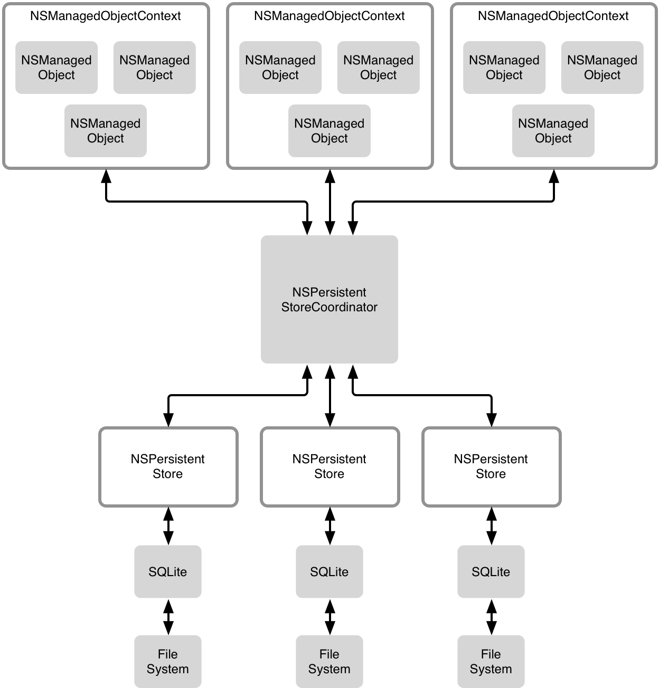
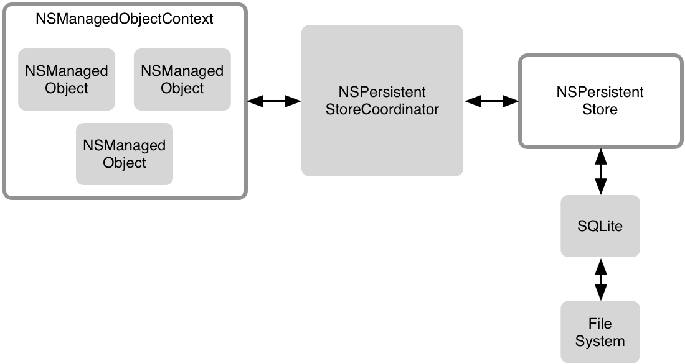

Core Data概述 [1]
===

Core Data 可能是在 OS X 和 iOS 的类库中最容易被误解的了。为了帮助读者了解它，我们会快速的过一遍相关知识，让你对它是什么有一个大概的了解，因为对 Core Data 概念的正确把握是正确运用 Core Data 的必要条件，几乎所有的在使用 Core Data 过程中遇到的挫折都与对下面两个问题的错误理解有关：它是做什么的、它是如何工作的。那么，我们就开始吧

Core Data 是什么？
---

2005年4月份，苹果公司发布了 OS X 10.4，第一版支持 Core Data 的 OS X，那时 YouTube 才刚刚成立。

Core Data 是一项模型（model）层的技术，它帮助你建立一个模型来表示你的 app 的状态；Core Data 同时也是一项持久层的技术，它会把模型对象的状态持久化存储到硬盘上；但最重要的，Core Data 不仅仅是一个存取数据的类库，它同时也会维护数据在内存中的读写。

它不仅仅是一套ORM，也不仅仅是一层对 SQL 的封装，尽管它默认使用 SQL：它是一层更高层次的抽象。如果你想把 Core Data 当做 ORM 或者对 SQL 的封装，那么 Core Data 不适合你。

Core Data 最强大的地方是它对属于它的对象的管理机制，这也是你需要掌握的地方。只有掌握了它，才能把 Core Data 的强大作用真正运用到实践中去。

还有一点，Core Data 是一个独立于任何 UI 层面类库的，它在一开始就被定位在一个纯净的模型层面的类库的位置，在 OS X 上，它很重要，甚至能被使用在后台的守护进程中。

栈结构
---

在 Core Data 中有许多组成部分，这是一种很灵活的结构，在大多数的场景中，这种设置方式是相对简单的。我们把这些组成部分统称为 Core Data 的栈结构。

在这个栈中，一共有两个主要的部分——一部分是关于内存对象管理的，你应该非常熟悉而且已经了解如何使用了；另一部分是关于持久存储的，这部分把内存模型对象持久化保存起来，也负责从持久化文件中恢复出这些内存对象的状态。在这两部分之间，也就是栈结构的中间，是持久化存储控制器（PSC：Persistent Store Coordinator），扮演一个审查员的角色。它把内存对象管理和持久化存储绑定在一起，这两部分可以通过这个审查员来进行通信。



你的模型层逻辑代码一般与内存对象管理部分打交道。每一个模型对象都会有一个上下文环境，在大多数的场景中，所有的模型对象都共享同一个上下文环境；当然在高级场景中，也可能会有几个上下文环境。需要注意的是，每个上下文环境彼此之间是不同的，我们会在后面有更多的介绍。每一个模型对象都绑定在一个上下文环境中，每个上下文环境也知道它所管理的所有模型对象，这是要注意的很重要的一点。

当 Core Data 要从文件系统读写数据时，Core Data 堆栈结构的另一部分持久层就要起作用了。几乎在所有的场景中，PSC 都与一个持久化存储相关联，而且这个持久化存储通常是 SQLite 数据库。同样，对于一些高级场景，Core Data 也可能有把 PSC 与几种除开 SQL 以外的持久化存储相关联。

最常见的结构通常如下图所示：



各个部分是如何一起工作的
---

让我们快速的通过一个栗子来过一遍各部分之间是如何协同工作的。在[这篇文章](SimpleButCompleteApplication.org)中会讨论一个使用 Core Data 的完整的应用，文章中的栗子里有会用到一个实体——一个拥有一个 title 字段的实体，每一项都有子项，这样我们就建立了一个父子关系——这就是我们的数据模型。

正如我们在[Data Model 和 Model Object](DataModelsAndModelObjects.org)中提到的，在 Core Data 中，一类内存对象统称为一种实体。在文章中的栗子里，我们只有一种实体：Item 实体，这种实体是 NSManagedObject 的子类。Item 实体会映射到 Item 类，这种机制在文章中会详细阐述。

我们的应用有一个根 item，它并没有什么特殊的地方，只不过是我们用来显示 Item 层次结构的一个 item，一个我们从来不会给它设置父 item 的 item。

当我们的应用启动时，我们会按照上面的图示设置好我们的 Core Data 栈结构——一个持久化存储、一个内存对象上下文和一个用于两部分通信的 PSC。

当应用第一次启动时，并没有任何的 item，我们第一件要做的事情就是创建一个根 item，你可以通过把它插入到上下文中的方式来管理这些对象。

创建对象
---

你可以用 NSEntityDescription 的这个方法创建对象：

``` objective-c
+ (id) insertNewObjectForEntityForName:(NSString *)entityName
                inManagedObjectContext:(NSManagedObjectContext *)context
```

它看起来有点儿笨重。我们另外建议你给你的模型类添加两个额外的方法：

``` objective-c
+ (NSString *)entityName
{
    return @"Item";
}

+ (instanceType)insertNewObjectInManagedObjectContext:(NSManagedObjectContext *)moc
{
    return [NSEntityDescription insertNewObjectForEntityForName:[self entityName]
                                         inManagedObjectContext:moc];
```

现在，我们可以通过下面的方法插入一个根 item：

``` objective-c
Item *rootItem = [Item insertNewObjectInManagedObjectContext:managedObjectContext];
```

目前我们在上下文中只有一个 item，上下文知道这个新插入的 item 这个根 item 也知道这个上下文（它有一个 -managedObjectContext 的方法）。


保存更改
----
到目前为止，我们还没有接触过 PSC 或持久化存储，新建的对象 rootItem 只是停留在内存中。如果我们想把对象的状态永久保存，我们要把上下文存储起来：

``` objective-c
NSError *error = nil;
if (![managedObjectContext save:&error]) {
	// Uh, oh. An error happened. :(
}
```

当程序运行到这段代码时，会发生许多事情：首先，上下文要找出发生了哪些变化。事实上，当你对内存对象进行变更时，上下文会把这些变更都记录下来。在我们的栗子中，唯一的变化就是我们插入了一个新的对象 rootItem。

接下来，上下文会把这些变化传递给 PSC，并让它把这些变化记录在持久存储层，PSC 会控制持久存储层把我们新插入的对象写入到 SQL 数据库中。事实上，真正与 SQLite 交互并生成所需的 SQL 代码的是 NSPersistentStore 这个类，而 PSC 仅仅是作为上下文和持久化存储的媒介。在我们的栗子中，它扮演的角色相对简单，但是在一些复杂的场景中，它可能会同时和多种上下文和持久化存储相关联。

更新关系
---
Core Data 有很强的关系管理能力。让我们看一个简单的栗子，下面这段代码会新建一个 item，并把这个新建的 item 设为 rootItem 的子 item。

``` objective-c
Item *item = [Item insertNewObjectInManagedObjectContext:managedObjectContext];
item.parent = rootItem;
item.title = @"foo";
```

简单四行代码就完成了，这些变化同样的也只是发生在上下文中，直到我们保存了上下文，这个新建的对象才会像我们新建的第一个对象一样被持久化存储到数据库文件中。上段代码会同时更新 rootItem 与新建的 item 的关系和新建的 item 与 rootItem 的关系。这里需要注意的是一个 item 实体有一个 parent 和一个 children 两个关系，它们是互逆的。也就是说当我们把第一个 item 设置成第二个 item 的 parent，也就相当于同时把第二个 item 设为了第一个 item 的children。上下文会记录下这些关系并把这些关系通过 PSC 存储到硬盘上。

查询内存对象
---
假设我们已经使用了我们的应用有一段时间了，在使用期间，给 rootItem 添加了若干个子 item，这些子 item 也拥有了属于它们的子 item，并且Core Data 已经把这些 item 的状态和关系存储到了数据库文件中。现在我们重启应用，我们需要找到 rootItem，这样才能把第一层的所有 item 都列出来。要实现这一目的，有两种方法，先来看看简单的那种。

当我们创建了 rootItem，并且保存了它，我们就可以知道它的 NSManagedObjectID，这是表示它的唯一对象，我们可以把这个对象存储到 NSUserDefaults 中：

``` objective-c
NSUserDefaults *defaults = [NSUserDefaults standardDefaults];
[defaults setURL:rootItem.managedObjectID.URLRepresentation forKey:@"rootItem"];
``` 

现在应用重启了，我们可以像这样把 rootItem 重新找出来。

``` objective-c
NSUserDefaults *defaults = [NSUserDefaults standardUserDefaults];
NSURL *uri = [defaults URLForKey:@"rootItem"];
NSManagedObjectID *moid = [managedObjectContext.persistentStoreCoordinator managedObjectIDForURIRepresentation:uri];
NSError *error = nil;
Item *rootItem = (id)[managedObjectContext existingObjectWithID:moid error:&error];
```

显然，在实际使用中，我们还要检查 NSUserDefaults 是不是返回了一个有效值。

我们已经使用上下文通过 PSC 从数据库中找到了想要的 Item，但是所有其他的 item 还没有被载入到内存中。别忘了，rootItem 有一个叫 children 的关系，如果我们想找 rootItem 的所有子 item，可以这样：

``` objective-c
NSOrderedSet *childer = rootItem.children;
```

现在，上下文发现 rootItem 的 children 关系还是 fault，Core Data 通常会把待解决的问题做一些标记，而这个 fault 就是其中之一。既然我们要查找这个仍然是 fault 的关系，上下文就会自动通过 PSC 把这些子 item 重新载入到上下文中。

这种方法看起来十分简单，但实际上会触发许多事情。如果已经有一些子 item 被载入到了内存中，Core Data 就会复用它们，这就是所谓的_唯一_（uniquing），在上下文中，永远不会有一个以上的内存对象表示同一个 item。另外，PSC 有一套它自己的机制用来缓存内存对象的值。如果上下文需要查找一个对象，而 PSC 又已经把所需要的值缓存了起来，那么这个对象就可以不用经过对持久化存储的查询而直接被载入到上下文中。这是一个很重要的机制，因为通过 SQL 代码来访问数据库要远远低于直接使用内存中数据的效率。

当我们沿着 item 的关系树一路走下去，我们就逐渐的把所有的 item 都载入到了上下文中。一旦到了这一时间，对 item 的操作、对关系的遍历将变得十分迅速，因为这些动作将全部都在内存中完成而不必再去通过 PSC 与持久化存储打交道了，访问 item 的 title、parent 和 children 也会变的十分快。

理解数据是如何被查询的是很重要的，因为它会影响到性能。在我们的栗子中，还不是太明显，因为我们没有使用到太多的数据，但很快你就需要了解查询过程中都发生了什么。

当我们通过关系访问对象时（在我们的栗子中是 parent 和children），可能会发生以下三种情况：
1. 对象已经被载入到上下文中，访问它很快
2. 对象没有被载入到内存中，但是可能你最近从持久化存储中查询过它，所以 PSC 中可能会有缓存数据，这种情况的查询代价相对来说很小。
3. 要查询的对象既没有在上下文中出现过、也没有被 PSC 缓存过，就只能从 SQLite 中查询了。这种情况的查询代价最大，而且远远大于前两种。

如果你知道你要查询数据，如果你限制了查询数据的数量，这样做会对性能有极大的改善。在我们的栗子中，我们可能要查询所有的子 item 而不是一个一个的找，这种情况下，我们可以创建一个 NSFetchRequest，同时也需要注意只有在需要的时候才发起查询请求，因为一个查询请求也可能会引起上述第（3）种情况发生：它总是会访问 SQLite 数据库。这样性能就受到了影响，如果你在查询之前检查通过 [```- [NSManagedObjectContext objectRegisteredForID]```](https://developer.apple.com/library/ios/documentation/Cocoa/Reference/CoreDataFramework/Classes/NSManagedObjectContext_Class/NSManagedObjectContext.html#//apple_ref/occ/instm/NSManagedObjectContext/objectRegisteredForID:)检查一下这个对象是不是已经被载入到了上下文中，将会一定程度上改善性能。

改变对象的值
---
现在让我们一起试着改变一个 item 的 title：


``` objective-c
item.title = @"New title";
```

当代码运行到这时，这个 item 的 title 就被改变了，同时，上下文也会把这个 item 标记为已更改状态，当我们下一次调用 save 方法时，PSC 会把这次更改写入数据库 —— 上下文的一个关键责任就是记录下来这些更改。

上下文知道从上一次保存至今哪些对象是新插入的、哪些是被更改的、哪些是已删除，你可以通过 - inserterdObjects、- updatedObjects 和 - deletedObjects 来获取这些对象，也可以通过 - changedValues 来查看变更状态的对象的变更的属性。
尽管你可能永远也不会用到这些方法，但这些方法是 Core Data 用来把更改写入数据库的途径。

保存过程需要 PSC 和持久化存储层轮流访问 SQLite 数据库。当我们从数据库查询时，所耗费的代价要比在内存中查询高；但保存时，这个代价是固定的，不管你一次保存了多少数据，代价都是按次算的，每次的代价取决于 SQLite 的工作方式。当你进行了大量的更改，在需要保存时，你就需要一次保存一定数量的更改：如果你每次在做修改时都保存，你就会付出很高的代价，因为保存得太频繁了；如果你保存得频率过低，在每次保存时，SQLite 又有太多的更改需要处理。

另一个需要注意的地方是保存操作时原子性的，它们是一个事务——要么所有的改变都被存储下来，要么 SQLite 一个改变也不存储，当自定义 NSIncrementalStore 子类时需要谨记这点。你必须保证保存操作不会失败，一旦失败的话，你要回滚这次保存得所有操作。不然，内存重的对象状态会与数据库中的状态不一致。

一般情况下，保存操作时不会失败的，但是当 Core Data 允许每个持久化存储可以关联多个上下文时，PSC 可能会出现冲突。因为不同的改变是被记录在不同的上下文中的，其他的上下文就可能会引入冲突。就算一个 Core Data 栈结构中只有一个持久化存储，也可能会导致冲突（比如，一个上下文要更新一个对象的值但另一个上下文却要删除这个对象）。另一个可能会失败的原因是验证失败，Core Data 支持复杂的验证机制。举个简单的验证规则的栗子，比如一个 item 的 title 字段长度必须小于 300。当然，Core Data 也支持跨属性的验证。

总结
---
如果你认为 Core Data 看起来令人畏惧，那最可能的原因就是它允许你用特别复杂的方法来使用，只需时刻牢记一点：努力让事情变得简单。它会使开发变得容易，减少你和你的用户的麻烦。只有在你确信复杂的方法（比如后台上下文）会真正带来帮助时，才去使用复杂的配置。

当你使用简单的 Core Data 栈结构，或者说你使用了我在本文中介绍的对象管理方法时，你会很快发现 Core Data 能给你提供许多帮助，并且使用它开发会加速你的开发周期。

本话题的更多文章
---
* [一个简单却完整的 Core Data 应用](SimpleButCompleteCoreDataApplication.md)
* [使用 SQLite 和 FMDB 替代 Core Data](UsesSQLiteInsteadOfCoreData.md)
* [Data Model 和 Model Objects](DataModelsAndModelObjects.md)
* [导入大量数据]()
* [查询](PerformantFetching.md)
* [自定义 Core Data 的数据迁移](CustomCoreDataMigrations.md)


Footnotes
---

[1] 原文链接：http://www.objc.io/issue-4/core-data-overview.html
